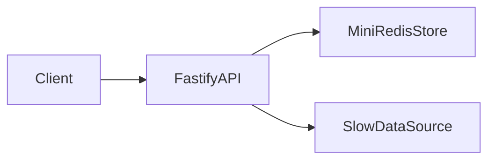
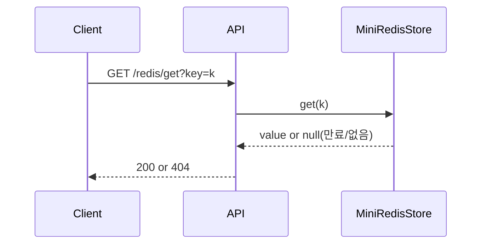
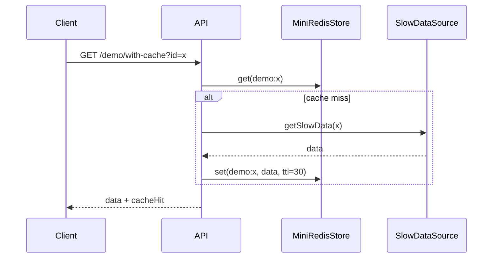

# 02. Architecture

## 1) 기술 스택 선택 이유

| 영역 | 선택 기술 | 선택 이유 | 대안 |
| --- | --- | --- | --- |
| Backend | Node.js + Fastify + TypeScript | 빠른 구현과 충분한 성능, 타입 안정성 | Express, NestJS |
| Data Store | In-memory `Map` | O(1) 평균 접근, 구현 단순 | Object, LRU 라이브러리 |
| Validation | Zod | 요청 검증 단순화 | Joi, class-validator |
| Testing | Vitest + Fastify inject | 단위/통합 테스트 속도 우수 | Jest + Supertest |

## 2) 시스템 구성



- API 역할: 입력 검증, 상태 코드/응답 포맷 제공
- RedisCore 역할: 키-값 저장, TTL, 무효화 처리
- SlowSource 역할: 캐시 효과 비교를 위한 느린 데이터 응답 시뮬레이션

## 3) 레이어 구조

```text
src/
├─ server.ts
├─ app.ts
├─ lib/
│  └─ mini-redis/
│     └─ store.ts
└─ services/
   └─ slow-data.ts
```

- `app.ts`: 라우팅 + 요청 검증 + 응답 계약
- `store.ts`: 핵심 저장소 로직
- `slow-data.ts`: 비교 실험용 데이터 소스

## 4) 데이터 모델

### RedisEntry

| 필드 | 타입 | 설명 | 필수 여부 |
| --- | --- | --- | --- |
| `value` | `string` | 저장 값 | Yes |
| `expiresAt` | `number \| null` | 만료 시각(epoch ms) | No |

## 5) 정합성/동시성 규칙

- 키는 문자열이며, 빈 문자열은 허용하지 않습니다.
- TTL 미설정 키는 영구 보관(`ttl = -1`)입니다.
- 만료된 키는 조회 시점(lazy expiration)에 즉시 삭제합니다.
- 주기적 정리(active cleanup)로 백그라운드 만료 키를 정리합니다.
- 동시성 모델은 단일 Node 프로세스 이벤트 루프 기반입니다.

## 6) 핵심 시퀀스 다이어그램

### Flow A. GET with TTL 검사



### Flow B. Cache 비교 API



## 7) 운영/배포 메모

- 실행 환경: Node.js 20+
- 환경 변수: 기본 없음(포트 3000 고정)
- 배포 전략: 로컬 실행/워크숍 데모 우선
- 모니터링: 기본 로그 + 벤치마크 결과 문서화